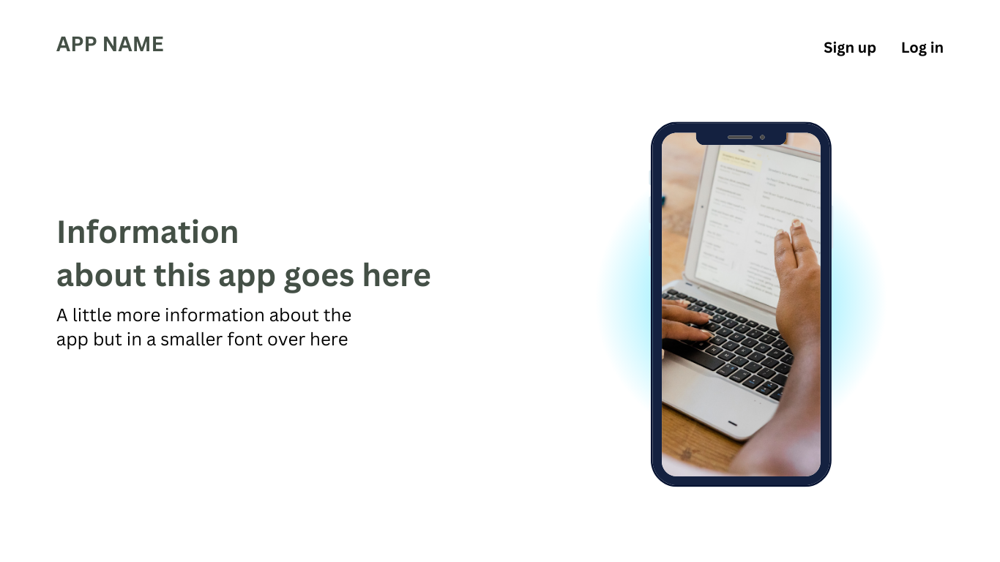
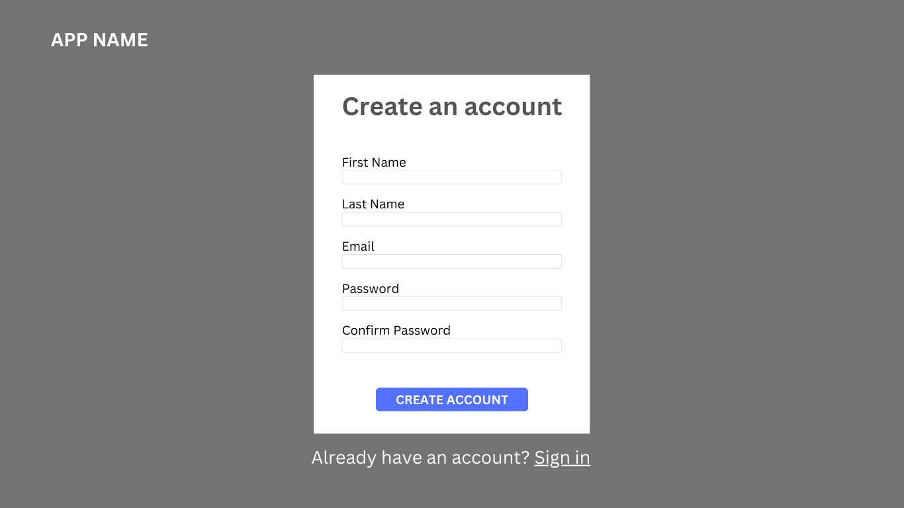
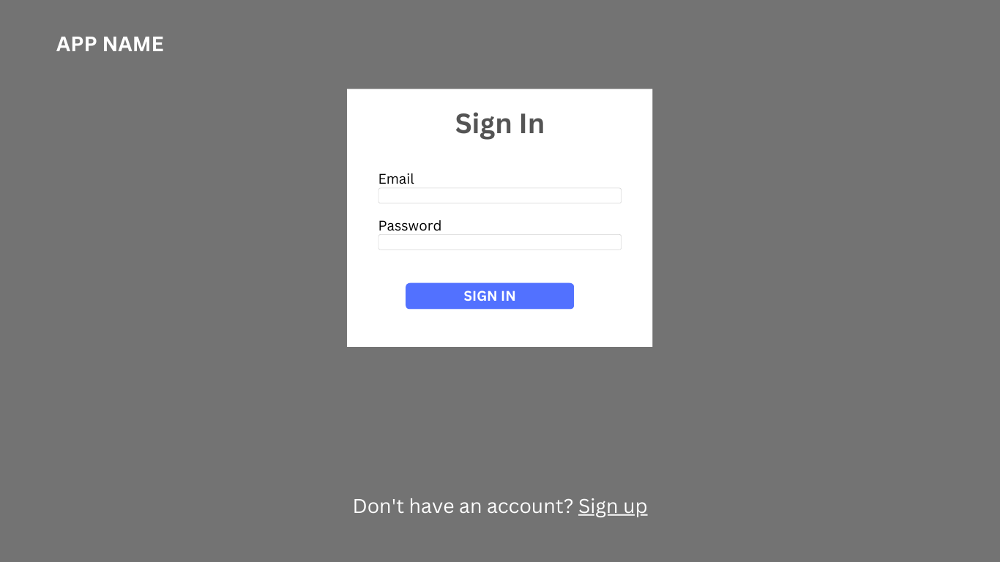
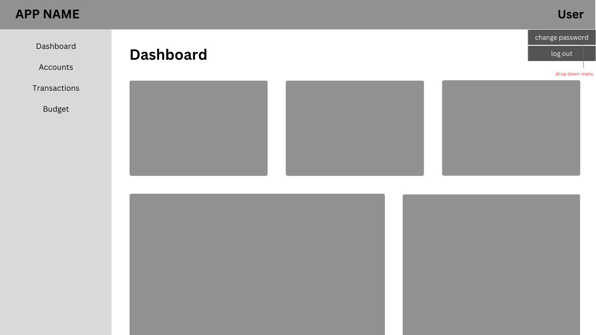
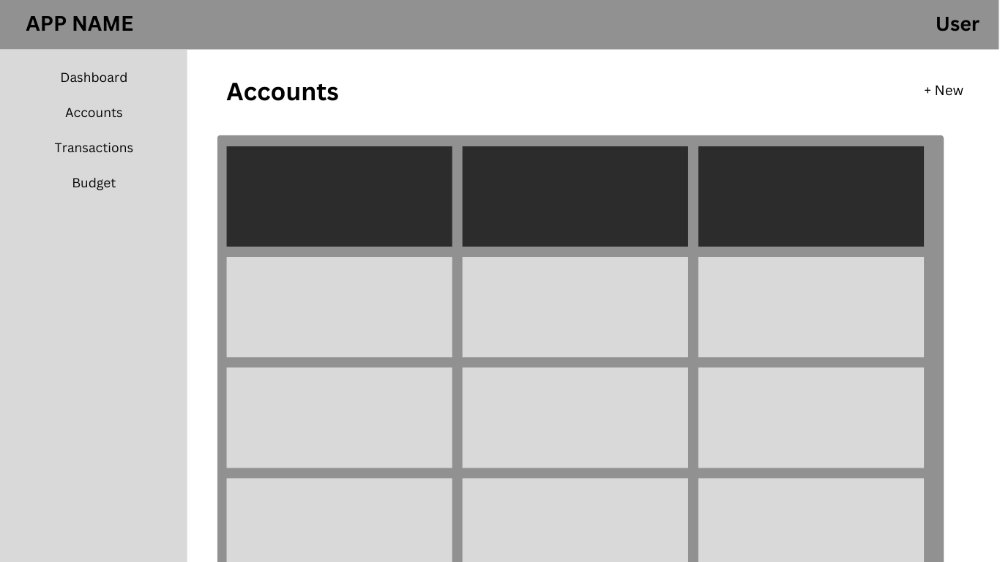
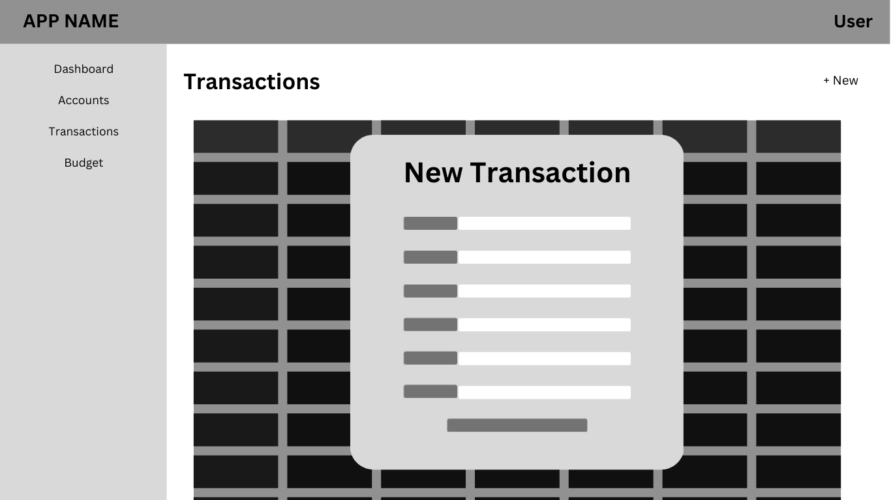
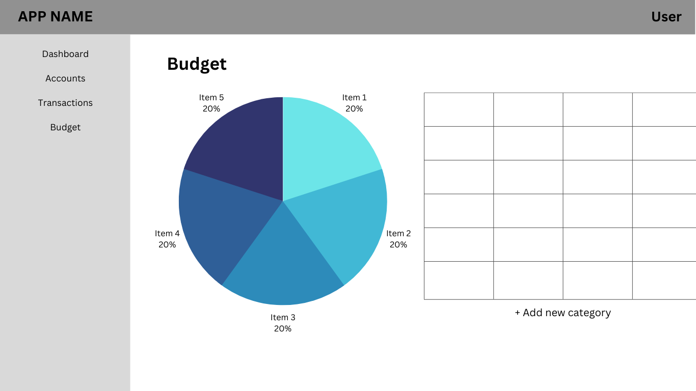
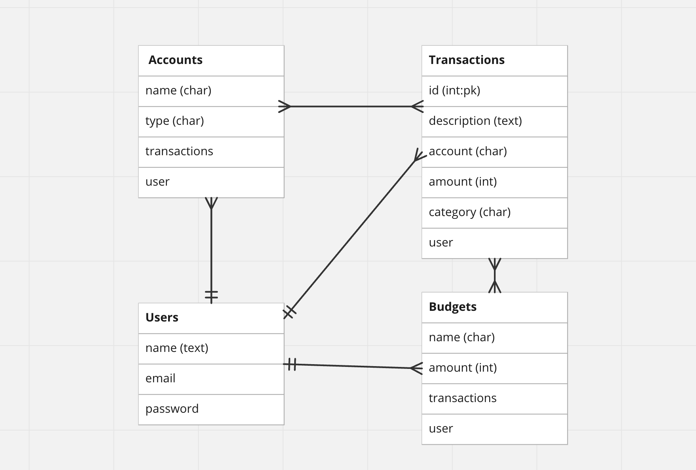

# FinDash

Capstone Project

## Overview

This app allows users to track their finances and spending.

Features:

- Budget tracking
- Balance Sheet
- Tab splitting

### Technologies

- Python
- Django
- Bootstrap
- SQL
- ApexCharts
- Popper

## User Stories

```txt
As a user, I want the ability to...
- sign up for a profile.
- sign in to my profile.
- change my password.
- log out of my profile.
- create accounts.
- track the balances of my accounts.
- view individual accounts.
- delete accounts.
- create transactions.
- update transactions.
- delete transactions.
- categorize my transactions.
- flag transactions.
- create budgets/savings goals.
- track my budget/savings goals.
```

## Wireframes









## Entity Relationship Diagram



## URL Paths

### Wallet (Accounts)

| Path                    | View                         | Name          |
|-------------------------|------------------------------|---------------|
| wallet/                 | views.wallet_index           | wallet_index  |
| wallet/create/          | views.WalletCreate.as_view() | wallet_create |
| wallet/<int:pk>/update/ | views.WalletUpdate.as_view() | wallet_update |
| wallet/<int:pk>/delete/ | views.WalletDelete.as_view() | wallet_delete |

### Transactions

| Path                               | View                              | Name                |
|------------------------------------|-----------------------------------|---------------------|
| transactions/                      | views.transactions_index          | transactions_index  |
| transactions/create/               | views.TransactionCreate.as_view() | transactions_create |
| transactions/<int:transaction_id>/ | views.transactions_detail         | transactions_show   |
| transactions/<int:pk>/update/      | views.TransactionUpdate.as_view() | transactions_update |
| transactions/<int:pk>/delete/      | views.TransactionDelete.as_view() | transactions_delete |

### Budget

| Path                     | View                         | Name           |
|--------------------------|------------------------------|----------------|
| budgets/                 | views.budgets_index          | budgets_index  |
| budgets/create/          | views.BudgetCreate.as_view() | budgets_create |
| budgets/<int:pk>/update/ | views.BudgetUpdate.as_view() | budgets_update |
| budgets/<int:pk>/delete/ | views.BudgetDelete.as_view() | budgets_delete |

### Authentication

| Path                     | View                 | Name            |
|----------------------    |----------------------|-----------------|
| accounts/signup/         | views.signup         | sign_up         |
| accounts/signin/         | views.signin         | sign_in         |
| accounts/changepassword/ | views.changepassword | change_password |

## Stretch Goals

- Bill splitting feature
- Upload pictures of receipts

## Requirements

- django-bootstrap-v5